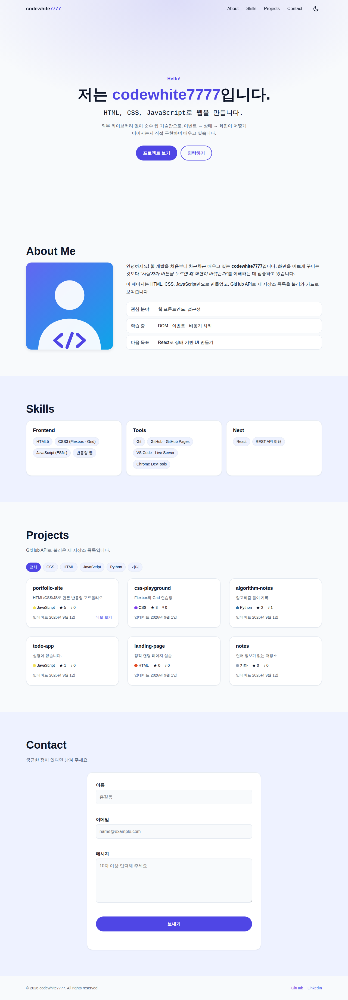
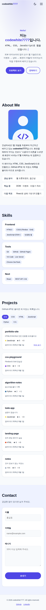
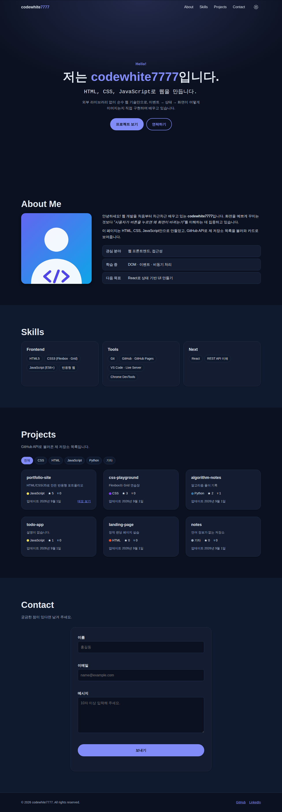
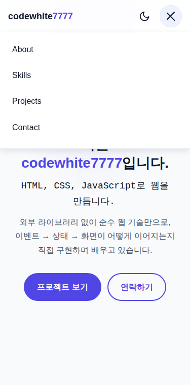
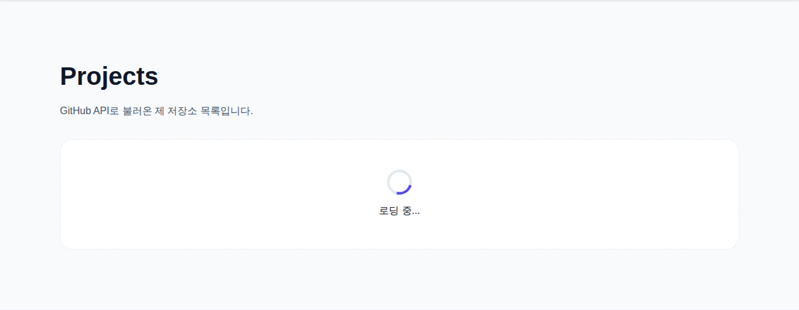
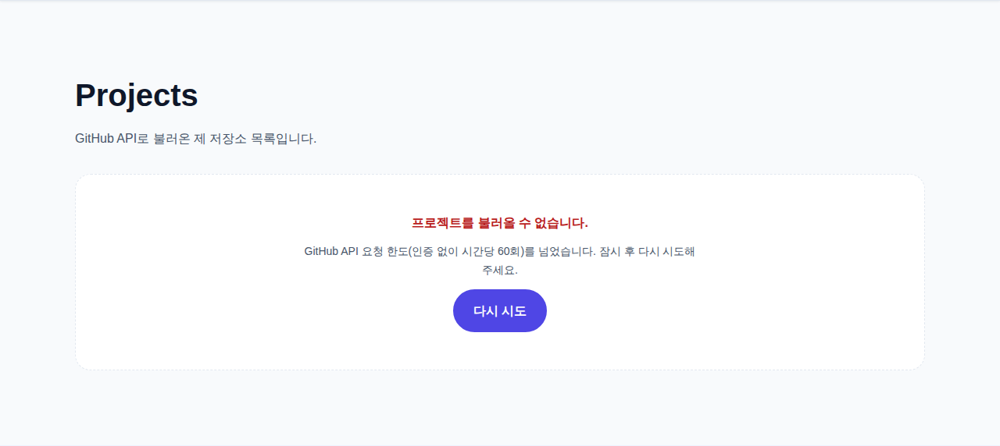
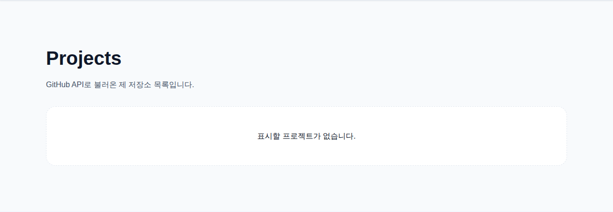

# 나를 소개하는 웹페이지 처음부터 만들기

Codyssey **웹 기초와 프론트엔드** 과제 — 외부 라이브러리 없이 **순수 HTML / CSS / JavaScript**만으로 만든 반응형 포트폴리오 웹사이트입니다.
단순히 화면을 그리는 것이 아니라 **"사용자 이벤트 → 상태 변경 → 화면(DOM) 업데이트"** 흐름이 코드에서 드러나도록 만드는 데 집중했습니다.

- **배포 URL**: <https://codewhite7777.github.io/codyssey_B1-1/>
- **저장소**: <https://github.com/codewhite7777/codyssey_B1-1>

<!-- TODO(제출 전): GitHub 저장소 Settings → Pages 에서 배포를 켜고 위 URL 접속을 확인할 것 (docs/02-evaluation-checklist.md 참고) -->

## 스크린샷

| 데스크톱 | 모바일 | 다크 모드 |
| :---: | :---: | :---: |
|  |  |  |

| 모바일 햄버거 메뉴 | 로딩 상태 | 에러 상태 | 빈 상태 |
| :---: | :---: | :---: | :---: |
|  |  |  |  |

> 위 스크린샷은 로컬 테스트 환경에서 GitHub API 응답을 **샘플 데이터로 대체해** 촬영했습니다.
> 배포 후에는 `node tools/screenshots.js <배포 URL>` 로 실제 화면을 다시 촬영해 교체하고, 이 안내 문구는 지웁니다.

## 사용 기술

| 구분 | 내용 |
| --- | --- |
| 마크업 | HTML5 시맨틱 태그(`header` `nav` `main` `section` `article` `footer`), 접근성 속성(`aria-*`, `label for`) |
| 스타일 | CSS3 — CSS 변수(`:root`, `[data-theme="dark"]`), Flexbox(네비게이션), Grid(`auto-fit` + `minmax` 프로젝트 카드), 모바일 퍼스트 미디어 쿼리(768px / 1024px), `transition` · `box-shadow` |
| 스크립트 | JavaScript(ES6+) — `const`/`let`, 화살표 함수, 템플릿 리터럴, 구조분해 할당, `map`/`filter`/`forEach`, `fetch` + `async/await` + `try/catch`, Intersection Observer, `localStorage` |
| 외부 API | GitHub REST API — `https://api.github.com/users/{아이디}/repos` |
| 개발 · 배포 | VS Code + Live Server, Git/GitHub, GitHub Pages |
| 검증 도구(사이트와 무관) | Node.js 스크립트 + Playwright — 요구사항 자동 점검(`tools/verify.js`) |

외부 라이브러리(React, Vue, jQuery, Bootstrap, Tailwind 등)는 사용하지 않았고, 폰트는 시스템 폰트, 아이콘은 인라인 SVG를 사용했습니다.

## 구현한 기능

- **반응형 레이아웃** — 모바일 퍼스트. 768px(태블릿) / 1024px(데스크톱)에서 레이아웃이 확장됩니다.
- **햄버거 메뉴** — 모바일에서 메뉴가 숨겨지고 버튼으로 열고 닫습니다. (`classList.toggle('active')`)
- **부드러운 스크롤** — 메뉴/버튼 클릭 시 해당 섹션으로 부드럽게 이동합니다.
- **스크롤 탑 버튼 · 네비게이션 배경 변경 · 스크롤 등장 애니메이션**
- **다크 모드** — 토글 버튼, 설정을 `localStorage`에 저장해 새로고침 후에도 유지합니다.
- **Contact 폼 검증** — 필수값, 이메일 형식, 입력창 아래 에러 메시지, `preventDefault()` 후 성공 메시지.
- **GitHub API 연동** — 저장소 목록을 카드로 렌더링하고 **로딩 / 성공 / 에러(+재시도) / 빈 상태**를 UI로 표현합니다.
- **보너스** — 언어별 프로젝트 필터(`array.filter`), Hero 타자기 효과, 시스템 다크 모드 감지(`prefers-color-scheme`).

### 기준값 (필요하면 `js/config.js`에서 변경)

| 동작 | 기준값 |
| --- | --- |
| 스크롤 탑 버튼 표시 | 스크롤 **300px 이상** |
| 네비게이션 배경색 변경 | 스크롤 **60px 이상** |
| 스크롤 애니메이션 (Intersection Observer `threshold`) | **0.2** (요소가 20% 이상 보일 때) |
| 반응형 브레이크포인트 | 태블릿 **768px** / 데스크톱 **1024px** (`min-width`, 모바일 퍼스트) |
| GitHub API 요청 제한 시간 | 10초 (초과 시 에러 상태) |

## 상태 → 렌더링 흐름

"이벤트가 상태를 바꾸고, 상태가 화면을 결정한다"는 구조를 4곳에 적용했습니다.

| 기능 | 이벤트 | 상태 | 렌더링 함수 |
| --- | --- | --- | --- |
| 다크 모드 | 토글 버튼 `click` | `themeState.theme` | `renderTheme()` — `<html data-theme>` 변경 → CSS 변수 교체 |
| GitHub 프로젝트 | 페이지 로드 / `다시 시도` 클릭 | `projectsState.status` (`loading` `success` `empty` `error`) | `renderProjects()` — 스피너 · 카드 · 빈/에러 메시지 |
| 문의 폼 | `input` `focusout` `submit` | `contactState.errors` `touched` `submitted` `success` | `renderContactForm()` — 에러 문구 표시/숨김 |
| 언어 필터 | 필터 버튼 `click` | `projectsState.filter` | `renderProjectCards()` — 카드 목록 변경 |

## 폴더 구조

```text
.
├── index.html              # 메인 페이지 (시맨틱 마크업)
├── css/
│   └── style.css           # 전체 스타일 (변수 → 기본 → 레이아웃 → 컴포넌트 → 섹션 → 반응형)
├── js/                     # 모두 defer 로 로드 (config → utils → 기능별 → main 순서)
│   ├── config.js           # GitHub 아이디, 기준값(60/300/0.2) 등 설정
│   ├── utils.js            # escapeHtml, sleep, localStorage 안전 래퍼
│   ├── theme.js            # 다크 모드
│   ├── nav.js              # 햄버거 메뉴, 부드러운 스크롤
│   ├── effects.js          # 스크롤 반응, 등장 애니메이션, 타자기 효과
│   ├── form.js             # 문의 폼 유효성 검사
│   ├── projects.js         # GitHub API, 4가지 상태, 언어 필터
│   └── main.js             # 진입점: 위 기능들을 조립해 실행
├── images/
│   ├── profile.svg         # 프로필 이미지(교체 대상)
│   ├── favicon.svg
│   └── screenshots/        # README 스크린샷
├── docs/                   # 학습·평가·피어리뷰 문서
└── tools/                  # 요구사항 자동 점검 / 스크린샷 도구 (사이트에서는 사용하지 않음)
```

## 실행 방법

**로컬 개발** — VS Code에서 폴더를 열고 확장 프로그램 *Live Server*의 `Go Live`를 누릅니다. (`index.html` 우클릭 → `Open with Live Server`)

**내 정보로 바꾸기**

1. `js/config.js`의 `githubUsername` — 프로젝트 카드에 불러올 GitHub 아이디
2. `index.html`의 `TODO(개인화)` 주석이 붙은 곳 — 이름, 자기소개, 프로필 사진(`images/profile.svg` 교체, `alt`도 함께), LinkedIn 주소, 푸터·noscript의 GitHub 링크(아이디를 바꿨다면)

> GitHub API는 인증 없이 **시간당 60회**로 제한됩니다. 짧은 시간에 새로고침을 반복하면 403 응답이 오고, 이때는 에러 상태 UI(`다시 시도` 버튼)가 표시됩니다.

**배포 (GitHub Pages)** — 저장소 `Settings → Pages → Build and deployment → Deploy from a branch` → `main` / `/ (root)` 선택 후 저장. 잠시 뒤 배포 URL로 접속할 수 있습니다. (모든 경로가 상대 경로라서 `/저장소이름/` 하위 주소에서도 동작합니다.)

## 요구사항 자동 점검

과제 요구사항을 항목별로 점검하는 스크립트가 있습니다. GitHub API는 가짜 응답으로 대체하므로 네트워크나 레이트 리밋과 무관하게 4가지 상태를 모두 재현합니다.

```bash
node tools/verify.js            # 정적 검사 + 브라우저(Playwright) 검사
node tools/verify.js --static   # 정적 검사만 (Node.js 만 있으면 실행됨)
```

브라우저 검사에는 Playwright(`npm i -g playwright`)와 Chromium이 필요합니다. 항목별 의미는 [`docs/02-evaluation-checklist.md`](docs/02-evaluation-checklist.md)를 참고하세요.

## 문서

| 문서 | 내용 |
| --- | --- |
| [`docs/00-study-plan.md`](docs/00-study-plan.md) | 80시간 학습 로드맵, 코드 읽는 순서, 변형 과제 |
| [`docs/01-concept-notes.md`](docs/01-concept-notes.md) | 웹 · DOM · 렌더링 · 이벤트 · 비동기 개념 정리 노트 |
| [`docs/02-evaluation-checklist.md`](docs/02-evaluation-checklist.md) | 요구사항별 구현 위치 · 확인 방법 · 자동 점검 항목 매핑 |
| [`docs/03-peer-review-guide.md`](docs/03-peer-review-guide.md) | 피어 평가 3회 설명 전략, 발표 대본, 예상 질문 Q&A |

## 알려진 한계

- Contact 폼은 프론트엔드 검증과 성공 메시지까지만 구현한 **데모 폼**이며 실제로 메일을 보내지 않습니다. (보너스: Formspree / EmailJS 연동으로 확장 가능)
- 모든 스크립트를 `defer`로 로드하므로, 저장된 테마가 다크일 때 첫 화면이 아주 잠깐 라이트로 보일 수 있습니다.
- 최신 Chrome 기준으로 확인했습니다.
